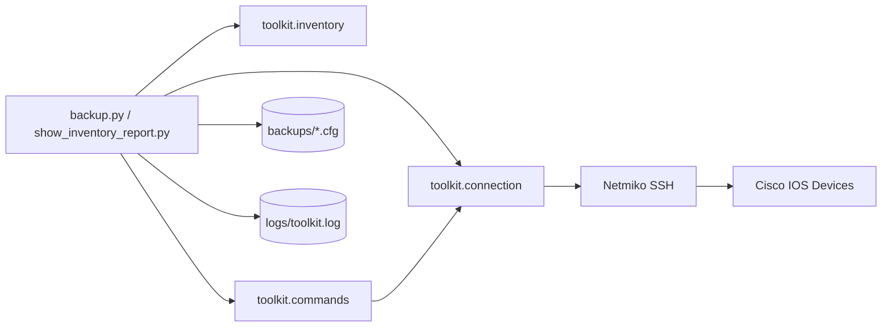
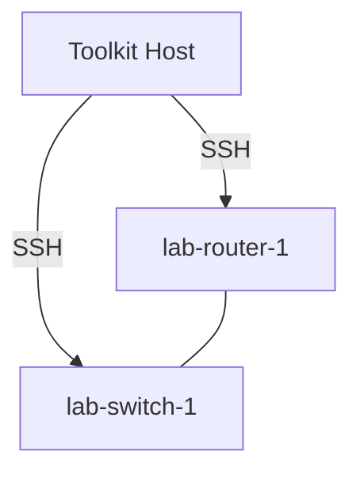

# Cisco Network Automation Toolkit

A Python toolkit for automating common Cisco IOS operational tasks over SSH: connecting to devices, backing up running configuration, running show commands, and collecting interface/VLAN/routing information. Built with Netmiko.

## Overview

This is a personal networking automation lab project built to practice the core skill set behind Network Automation / NetDevOps roles: scripted SSH connectivity, structured inventory, config backups, and lightweight parsing of CLI output.

## Problem

Manually logging into each device to pull configs or check interface status does not scale. This toolkit automates that workflow across a YAML-defined device inventory, with error handling and logging so partial failures do not stop the whole run.

## Features

- YAML-based device inventory with validation
- Netmiko-based SSH connection helper with credential handling via environment variables (never hard-coded)
- Running-config backup with timestamped files for drift detection
- Show-command execution: interface status, VLANs, routing table
- Tabulated inventory-wide reporting
- Structured logging to file and console
- Unit tests that mock Netmiko - no real devices required to verify the code

## Architecture



## Technologies

Python 3.10+, Netmiko, PyYAML, Tabulate, Pytest.

## Network Topology (example lab)

Designed to be tested against a free lab environment rather than physical hardware:



Any of the following work well for a free lab: GNS3, EVE-NG, Cisco Packet Tracer, or ContainerLab with a Cisco IOL/IOSv image.

## Installation

```bash
git clone https://github.com/JeevaNN-pan/cisco-network-automation-toolkit.git
cd cisco-network-automation-toolkit
python -m venv venv
source venv/bin/activate   # venv\\Scripts\\activate on Windows
pip install -r requirements.txt
```

## Configuration

1. Copy .env.example to .env (or export the variables directly) and set your lab credentials:

```bash
cp .env.example .env
```

2. Edit inventory/devices.yaml with your lab device names, hosts, and device_type.

## Usage

```bash
# Back up running-config for every device in the inventory
python backup.py

# Print interface + VLAN summary for every device
python show_inventory_report.py
```

## Example Output

```
=== lab-router-1 (192.168.100.1) ===
| interface        | ip_address    | status | protocol |
|-------------------|---------------|--------|----------|
| GigabitEthernet0/0 | 192.168.100.1 | up     | up       |
| GigabitEthernet0/1 | unassigned    | down   | down     |
```

## Testing

```bash
pytest
```

All tests mock Netmiko/socket calls, so the suite runs without any lab devices or network access.

## Project Structure

```
cisco-network-automation-toolkit/
|-- toolkit/
|   |-- connection.py     # Netmiko SSH connection helper
|   |-- inventory.py      # YAML inventory loader/validator
|   |-- commands.py       # Show-command execution + parsing
|-- inventory/devices.yaml
|-- backup.py             # CLI: back up running-config for all devices
|-- show_inventory_report.py  # CLI: interface/VLAN summary report
|-- backups/              # Generated config backups (gitignored)
|-- logs/                 # Generated logs (gitignored)
|-- tests/
|-- .env.example
`-- README.md
```

## Future Improvements

- Migrate to Nornir for concurrent multi-device execution
- Add NAPALM-based config diffing between backups
- Add Ansible playbooks alongside the Python scripts for comparison
- Export interface/VLAN reports to CSV/JSON for downstream tooling

## Limitations

- Show-command parsing uses simple whitespace splitting, not a full CLI parser (e.g. Genie/pyATS), so unusual output formats or multi-word status fields (like "administratively down") may split across columns
- Only tested against Cisco IOS/IOS-XE syntax; other vendors/NOS would need different commands and parsing
- No retry/backoff logic for flaky SSH sessions
- Not built for large-scale concurrent execution (devices are processed sequentially)

## Disclaimer

Personal learning/portfolio project for practicing network automation. Intended for use against lab environments (GNS3/EVE-NG/Packet Tracer/ContainerLab) that you own or are authorized to manage - not tested against, or intended for, production network infrastructure.
